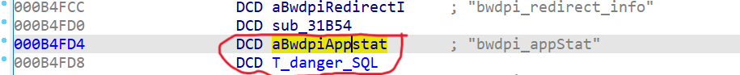
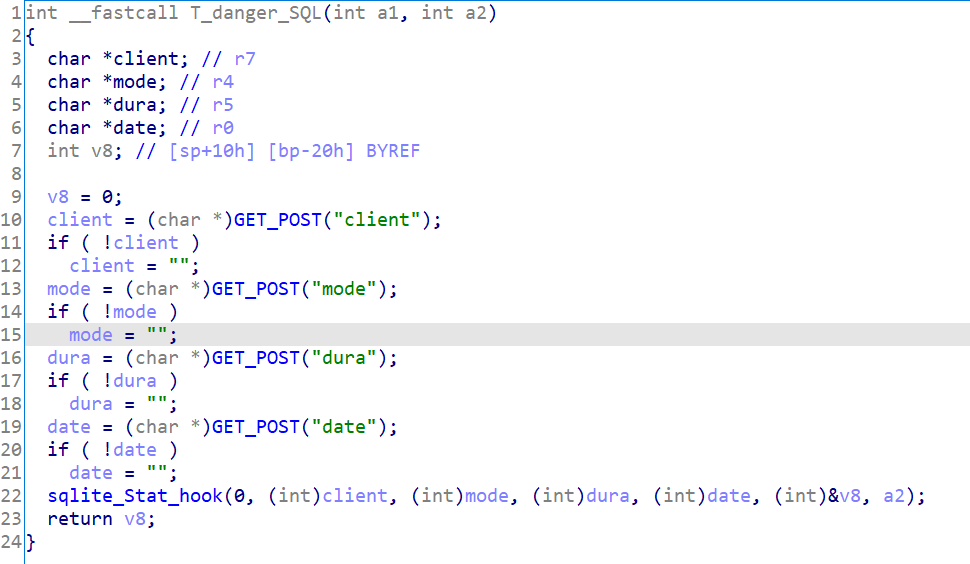
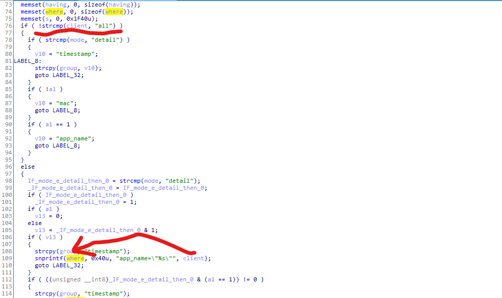
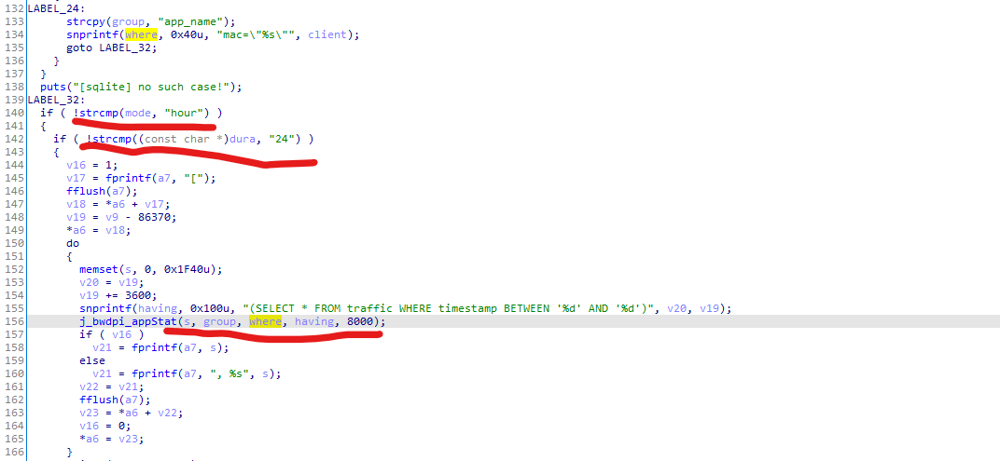
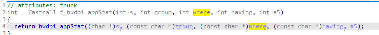
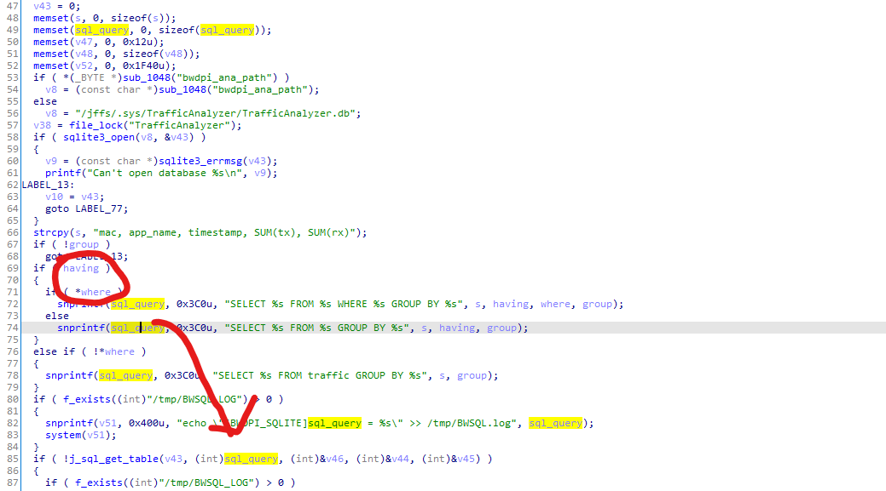
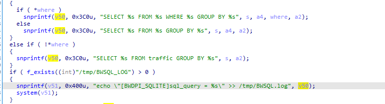

# [](#header-3)A report on the ASUS Routers Vuls in /usr/lib/libbwdpi_sql.so sqlite_Stat_hook caused SQL Injection in multiple series(Or even RCE in specified situation)

Vulnerability Product: GT-AC5300、GT-AC2900、RT-AC5300、specified versions in GT-AX and other versions that have not yet been discovered    
Vulnerability Test Firmware Version: GT-AC5300_3.0.0.4_386_51569-g9ee6a79_ubi.w (latest)  
Vulnerability type: SQL Injection(Or even RCE in specified situation)   
Vulnerability Authentication Requirement: Low privilege  

There is a SQL Injection(Or even RCE in specified situation) in ASUS specified lib `/usr/lib/libbwdpi_sql.so`. When an attacker has a low privilege account of the remote router system, the attacker could trigger SQL injection through the lib api: `/usr/lib/libbwdpi_sql.so`.`sqlite_Stat_hook`(On the GT-AC5300 the remote attacker calling path is `/usr/sbin/httpd`.`appGet.cgi`.`bwdpi_appStat` -> `/usr/lib/libbwdpi_sql.so`.`sqlite_Stat_hook`), and even cause RCE in specified situation

| Contents |
|--------|
| [Reverse(Take the GT-AC5300 as an example)](#reverse) |
| [Reverse-More](#more) |
| [Harm](#harm) |
| [A Possible Poc](#a-possible-poc) |
| [info](#info) |

## [](#header-3)Reverse:

Firstly let's see the function of web api `bwdpi_appStat` in `/usr/sbin/httpd`, I call it `T_danger_SQL` here. (the following Figure 1)

you can find that here it received GET args from user, Then call `sqlite_Stat_hook` with the `client`, `mode`, `dura`, `date` received from the user as parameters(the following Figure 2), please attention that here is no any filter

In the following steps, you will find that the param `client` is not filtered until the end

  
`Figure 1`  

  
`Figure 2`  

Secondly, let's see the `sqlite_Stat_hook` in `/usr/lib/libbwdpi_sql.so`, you can find that the param `client` just was simply formatted into `where` without any further filter when `client != "all"` is true. (the following Figure 3)

 then what happend to `where` ? You can see that when `mode == "hour" && dura == 24` is true, `where` is called as the third parameter to `j_bwdpi_appStat` (the following Figure 4)


  
`Figure 3`  

  
`Figure 4`  

Thirdly, let's see what happend in `j_bwdpi_appStat`. `j_bwdpi_appStat` call the `bwdpi_appStat` with the original parameters (the following Figure 5)

You can clearly find that when `having != NULL && where[0] != NULL` is true, the `where` is directly formatted into the `sql_query` and the SQL statement is executed without any filtering, resulting in SQL injection vulnerability (the following Figure 6)

  
`Figure 5`  

  
`Figure 6`  

#### [](#header-3)More: 

if `/tmp/BWSQL_LOG` exists, the `sql_query` will be formatted into command and executed directly, causing RCE (the following Figure 7)

  
`Figure 7`  

But it is difficult to make `/tmp/BWQL_LOG` exist, so no further discussion will be made here

## [](#header-3)HARM: 

When an attacker has a low privilege account of the system, the attacker could trigger SQL injection through the `bwdpi_appStat` in `appGet.cgi`(GT-AC5300) -> `sqlite_Stat_hook` in `/usr/lib/libbwdpi_sql.so`, attacker could SQL Inject by blind injection (such as time based injection, boolean based injection), and even cause RCE in specified situation

## [](#header-3)A Possible Poc: 

```
/appGet.cgi?hook=bwdpi_appStat()&mode=hour&dura=24&client="OR"1"="1&date=1000
```

Please note that due to certain specific reasons (I currently do not have the device for further debugging), I am temporarily unable to attach the exp. If you do require an exp after replying to this email, I will resend a exp within a few weeks

## [](#header-3)Info

This vulnerability was submitted for research purposes, So I hope to obtain a CVE number for research purposes regardless of whether there is a bounty or not

discovered by leeya_bug  
