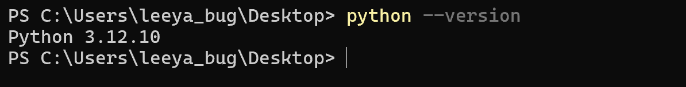
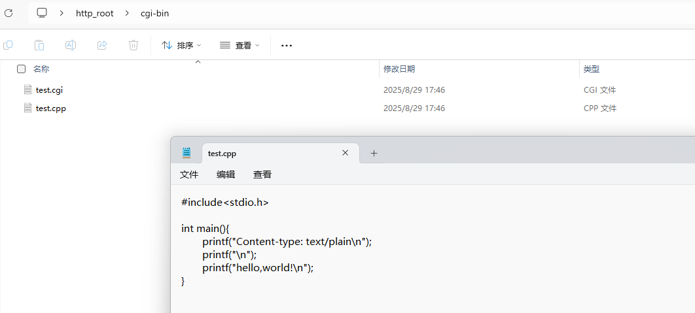
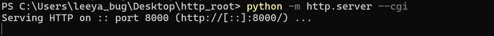
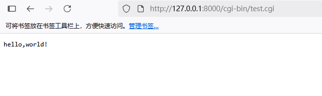
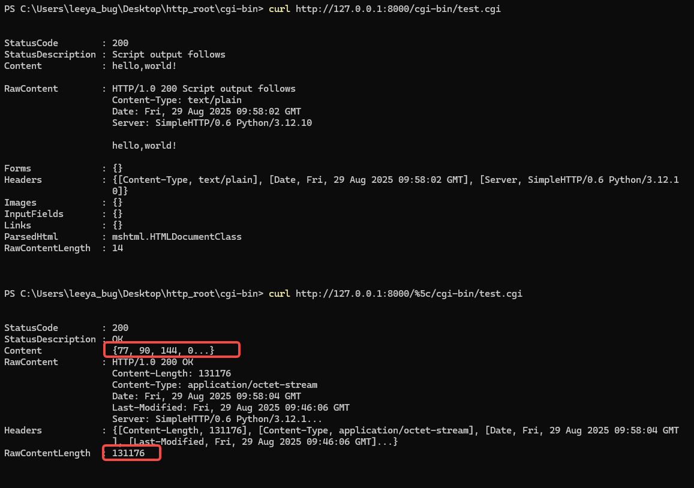
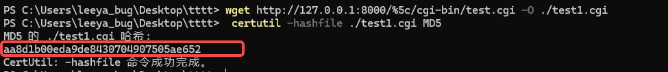
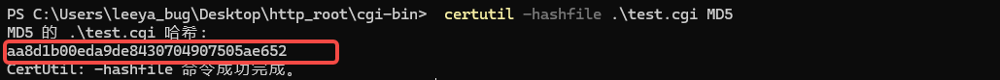
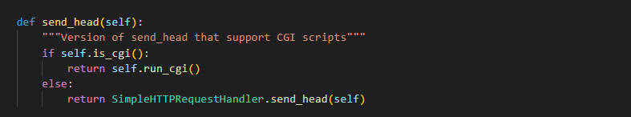
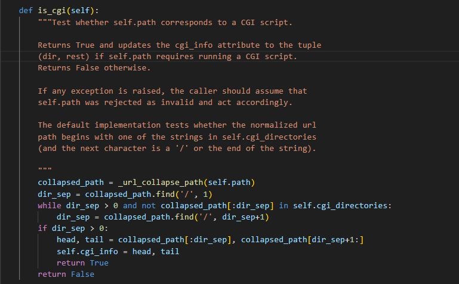
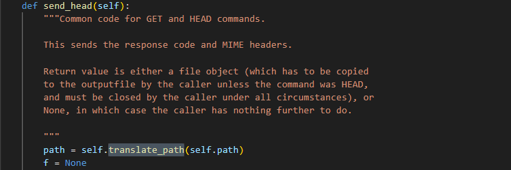

# [](#header-3)A report on the Python http.server CGI Bypass: Source Code Disclosure

Vulnerability Product: Python   
Vulnerability type: CGI resolve bypass and source code/program disclosure  
Vulnerability Version:   
&nbsp;&nbsp;&nbsp;&nbsp;Affected — from Python 3.0.0 below 3.0.1  
&nbsp;&nbsp;&nbsp;&nbsp;Affected — from 3.1.0 below 3.1.5  
&nbsp;&nbsp;&nbsp;&nbsp;Affected — from 3.2.0 below 3.2.6  
&nbsp;&nbsp;&nbsp;&nbsp;Affected — from 3.3.0 below 3.3.7  
&nbsp;&nbsp;&nbsp;&nbsp;Affected — from 3.4.0 below 3.4.10  
&nbsp;&nbsp;&nbsp;&nbsp;Affected — from 3.5.0 below 3.5.10  
&nbsp;&nbsp;&nbsp;&nbsp;Affected — from 3.6.0 below 3.6.15  
&nbsp;&nbsp;&nbsp;&nbsp;Affected — from 3.7.0 below 3.7.17  
&nbsp;&nbsp;&nbsp;&nbsp;Affected — from 3.8.0 below 3.8.20  
&nbsp;&nbsp;&nbsp;&nbsp;Affected — from 3.9.0 below 3.9.23  
&nbsp;&nbsp;&nbsp;&nbsp;Affected — from 3.10.0 below 3.10.18  
&nbsp;&nbsp;&nbsp;&nbsp;Affected (Deprecated) — from 3.11.0 below 3.11.13  
&nbsp;&nbsp;&nbsp;&nbsp;Affected (Deprecated) — from 3.12.0 below 3.12.11  
Vulnerability Authentication Requirement: No  
Notice: May only affect the vast majority of versions of Windows Operation System
Discovered by: leeya_bug


Python’s http.server module is a lightweight HTTP server that originated in the early standard library, combining the functionality of the old SimpleHTTPServer (for serving static files) and CGIHTTPServer (for running Common Gateway Interface scripts). Its roots lie in the CGI standard of the 1990s, which allowed web servers to execute external scripts (often in Python or Perl) to generate dynamic content. Within http.server, the class CGIHTTPRequestHandler enabled developers to place scripts in a designated directory (such as /cgi-bin/) and have them executed in response to HTTP requests, simulating the behavior of traditional web servers.  

A CGI resolve bypass and source code/program disclosure vulnerability exists in Python http.server. When an attacker has no privileges on a remote instance running `python -m http.server --cgi`, it is eazy to bypass the CGI execution by injecting a crafted special character into the request path. This flaw allows the attacker to directly read and download the source code of CGI scripts, and under certain conditions, may even lead to remote code execution (RCE).

| Contents |
|--------|
| [PoC](#poc) |
| [Payload Attacking](#payload-attacking) |
| [Audit](#audit) |
| [My Info](#my-info) |

## [](#header-3)PoC

```cmd
curl https://testip:8000/%5c/{CGI}
```

For example, consider a CGI script accessible at:  
`https://192.168.1.3:8000/cgi-bin/test.cgi`  
By inserting a `%5c` (encoded backslash) at the beginning of the URL path, it is eazy to bypass the CGI resolve and get the raw CGI source code or script itself:  
`https://192.168.1.3:8000/%5c/cgi-bin/test.cgi`  

## [](#header-3)Payload Attacking

Here I choose the Python 3.12.10 as the test attacking target



First, set up a standard directory structure and place a Python CGI in to `/cgi-bin`, using `test.cgi` as the test script compiled from `test.cpp`.



[(Click to Download test.cgi)](test.cgi) [(Click to Download test.cpp)](test.cpp)

Directory structure:

cgi-bin/  
&nbsp;&nbsp;&nbsp;&nbsp;test.cgi  
&nbsp;&nbsp;&nbsp;&nbsp;test.cpp  


Secondly, run `python -m http.server --cgi` to start the cgi server, visit the test.cgi we just created, everything is ok, it returns `hello, world!` as expected.





Thirdly, adding a `%5c` at the beginning of the url path. You can found that there is a very big difference between the normal request `curl http://127.0.0.1:8000/cgi-bin/test.cgi` and the malicious request `curl http://127.0.0.1:8000/%5c/cgi-bin/test.cgi`

As shown in the red box in the image below, the response file received after sending a malicious request contains an executable file header, and its length is significantly greater compared to that of a normal request.  
All signs indicate that: `THIS IS A CGI`



Further verification: Let’s download the file and compare it with the original `test.cgi`; they have the same MD5 hash.  

we just download THE ORIGINAL CGI PROGRAM bypassed the cgi resolve





Vulnerability proved, but why this happend?


## [](#header-3)Audit: 

We all know that `CGIHTTPRequestHandler` is a subclass of SimpleHTTPRequestHandler in Python. When a GET request is received, the server executes the following logic inside `CGIHTTPRequestHandler`:



If `is_cgi()` returns True, the request is executed as a CGI script.  
If `is_cgi()` returns False, the server simply returns the script file contents as static code.  

However, due to incorrect path normalization in `_url_collapse_path` (called by `is_cgi()`), the presence of a backslash escape `%5c` at the beginning of the URL path causes `is_cgi()` to always return False. 



Meanwhile, the subsequent `translate_path` function correctly resolves the path, treating it as a valid script location.



This mismatch in logic results in a vulnerability: an attacker can bypass CGI resolve and force the server to treat CGI scripts as regular files, allowing direct source code disclosure and, in certain cases, paving the way for remote code execution (RCE).

## [](#header-3)My Info

This vulnerability was submitted for research purposes.  
I guarantee with my personality that the above reproduction process is true and effective on the Python 3.12.10.

leeya_bug  
Now work as IoT/Kernel Security Researcher in a Chinese National-Owned Institude  
